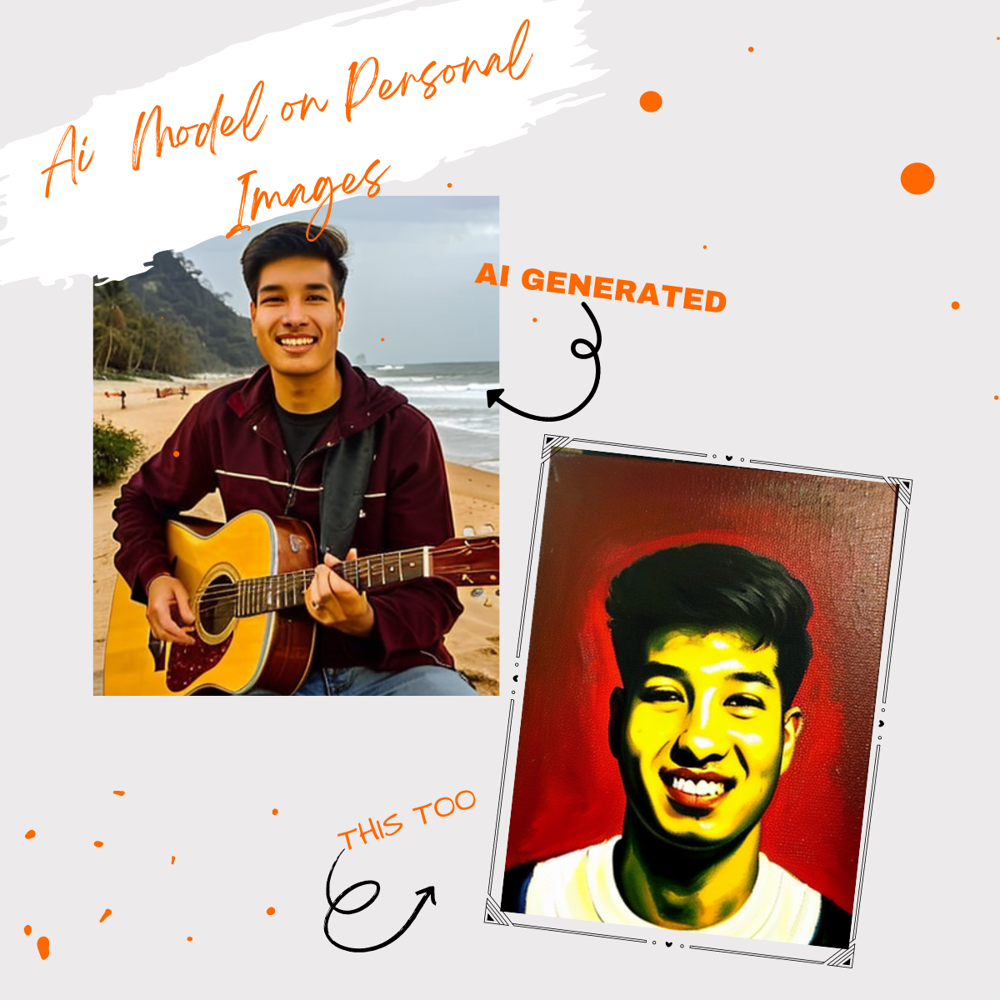
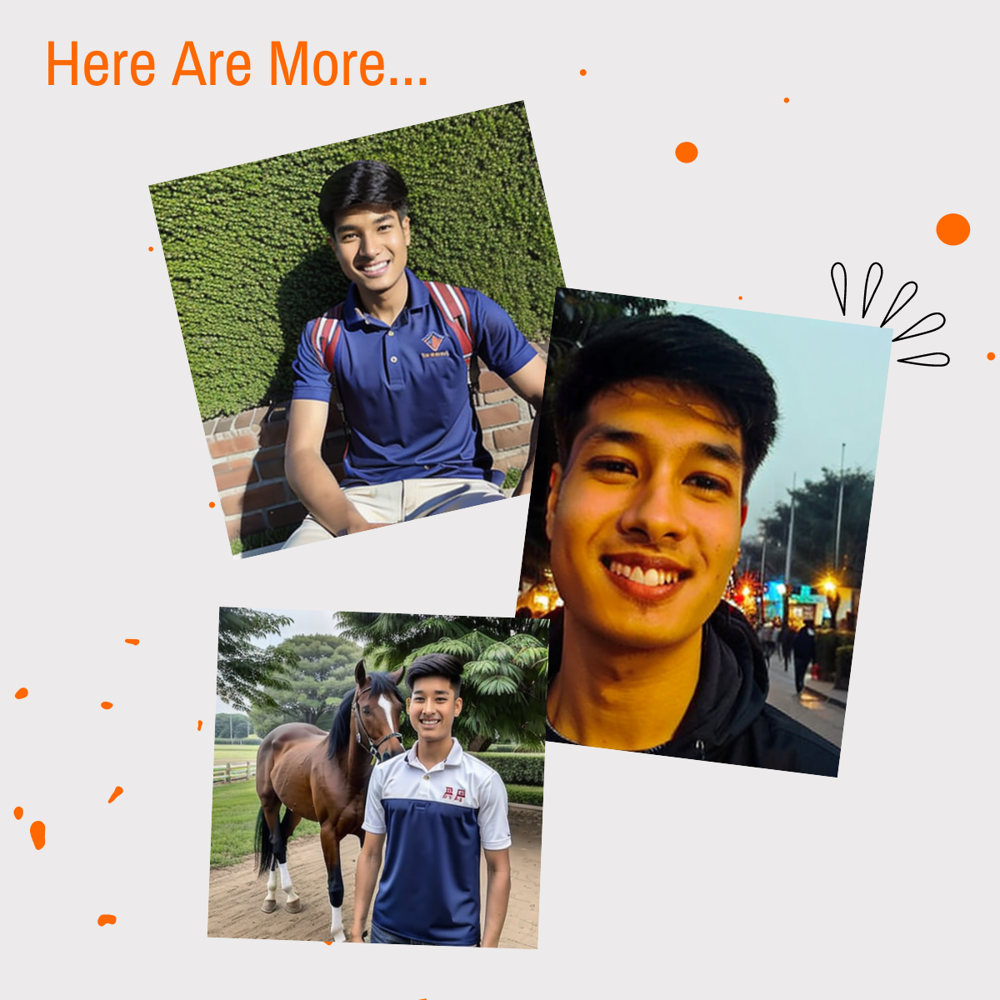

# Custom DreamBooth Model

#### ⚠️ IMPORTANT NOTICE ⚠️
**ALL IMAGES IN THIS DIRECTORY AND ITS SUBDIRECTORIES ARE PROHIBITED FROM USE.**
**SEE LICENSE_IMAGES FOR DETAILS.**

This project involves a custom DreamBooth model trained on a personalized dataset, fine-tuning the Stable Diffusion 1.5 model with Realistic Vision v6 as the base.

## Training Process

- Base Model: Stable Diffusion 1.5
- Template Model: Realistic Vision v6
- Training Method: DreamBooth
- Training Tool: Kohya SS

## Generation

Image outputs were generated using ComfyUI.

## Dataset

Used custom dataset of personal images

## Regularization Images

Used [Regularization Images](https://github.com/aitrepreneur/REGULARIZATION-IMAGES-SD)

## Results

>More Images are in images directory

## Image Usage Restrictions

All images in this directory and all of its subdirectories are subject to the IMAGE USAGE PROHIBITION LICENSE FOR CURRENT DIRECTORY AND SUBDIRECTORIES. 
See the [IMAGE_LICENSE](IMAGE_LICENSE) file in this directory for full details.
